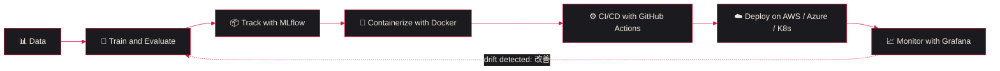

<!-- ===================== 🥷 HEADER ⚔️ ===================== -->
<div align="center">



<a href="https://git.io/typing-svg">
  
</a>

<br/><br/>


<p>
  <a href="https://linkedin.com/in/mitadru-mridha-4b94a9326"></a>
  <a href="mailto:mitadrumridha@gmail.com"></a>
  <a href="https://x.com/MitadruMri12266"></a>
</p>

</div>

<div align="center">⚔️ ━━━━━━━━━ 🥷 ━━━━━━━━━ ⚔️</div>


## 📜 巻物 · The Scroll (About Me)

```python
class MitadruMridha:
    def __init__(self):
        self.clan       = "B.Tech, Mechanical Engineering @ IIT Bhubaneswar"
        self.rank       = "Aspiring MLOps / Machine Learning Engineer"
        self.weapons    = ["Python", "SQL", "Git", "Machine Learning"]
        self.training   = ["Docker", "Kubernetes", "CI/CD", "AWS", "Azure"]
        self.focus      = ["ML Infrastructure", "Model Deployment", "Monitoring"]
        self.code       = "学ぶ → 作る → 展開 → 改善   # Learn → Build → Deploy → Improve"
        self.open_to    = ["ML Engineering", "MLOps", "Software Engineering"]

    def mission(self):
        return "Turn AI ideas into reliable, real-world systems."
```

> 🗡️ **継続は力なり** (*Keizoku wa chikara nari*): persistence is power. A samurai sharpens the blade daily, and I do the same with code, models and pipelines.
>
> 🥷 A ninja works unseen until the mission succeeds. Good MLOps is like that: when pipelines, deployments and monitoring work, nobody notices.

<div align="center">⚔️ ━━━━━━━━━ 🥷 ━━━━━━━━━ ⚔️</div>


## ⚔️ 武器 · Arsenal (Tech Stack)

<div align="center">

### 🐍 Languages & Data


### 🤖 Machine Learning & Deep Learning

<br/>


### ⚙️ MLOps, Deployment & Cloud


### 🌐 Backend & Tools


</div>

<div align="center">⚔️ ━━━━━━━━━ 🥷 ━━━━━━━━━ ⚔️</div>

## 🌑 忍法 · The Ninja Way (Workflow)



<div align="center">⚔️ ━━━━━━━━━ 🥷 ━━━━━━━━━ ⚔️</div>

## 🏯 任務 · Missions (Featured Projects)

<!--
  TODO: Replace the placeholder rows below with your real repositories.
  Recruiters look at projects first, so give each one a clear one-line outcome.
-->

| Mission | Objective | Weapons |
|---|---|---|
| **[🗡️ Project Name 1](https://github.com/MitadruMridha05/REPO_NAME_1)** | End-to-end ML pipeline: data ingestion → training → experiment tracking → REST API | `Python` `scikit-learn` `MLflow` `FastAPI` |
| **[🥷 Project Name 2](https://github.com/MitadruMridha05/REPO_NAME_2)** | Dockerized model-serving app with a CI/CD workflow that tests and builds on every push | `Docker` `GitHub Actions` `Flask` |
| **[🏯 Project Name 3](https://github.com/MitadruMridha05/REPO_NAME_3)** | Deep learning model (vision / NLP) with a reproducible training setup | `PyTorch` `TensorFlow` `Keras` |

<div align="center">

[](https://github.com/MitadruMridha05/Youtube_Sentiment_Analysis)
[](https://github.com/MitadruMridha05/House_Price_predictor)

</div>

<div align="center">⚔️ ━━━━━━━━━ 🥷 ━━━━━━━━━ ⚔️</div>

## 🩸 戦果 · Battle Record (GitHub Analytics)

<div align="center">


<br/>


<br/>


</div>

<details>
<summary>🏆 <b>Honours &amp; Trophies</b></summary>
<br/>

<div align="center">

[](https://github.com/ryo-ma/github-profile-trophy)

</div>

</details>

> 💡 If a stats card shows an error, the free host is rate-limited. Refresh after a minute, or self-host [github-readme-stats](https://github.com/anuraghazra/github-readme-stats).

<div align="center">⚔️ ━━━━━━━━━ 🥷 ━━━━━━━━━ ⚔️</div>

## 🥋 修行 · Current Training

- 🔭 Building end-to-end ML projects, from raw data to a deployed API
- 🐳 Containerizing models with **Docker** and automating builds with **CI/CD**
- ☁️ Learning **AWS** and **Azure** deployment patterns
- 📈 Experiment tracking and model versioning with **MLflow**
- 🧠 Strengthening ML fundamentals and Python engineering practices

## 🎖️ 段位 · Rank Progression

*Genin (下忍) → Chūnin (中忍) → Jōnin (上忍)*

| Skill area | Rank |
|---|---|
| Python, SQL, Git |  |
| Machine Learning (scikit-learn, Keras, PyTorch) |  |
| FastAPI / Flask model serving |  |
| Docker and CI/CD |  |
| Kubernetes, Cloud (AWS / Azure) |  |
| Monitoring (Grafana), Data/Model Drift |  |

<div align="center">⚔️ ━━━━━━━━━ 🥷 ━━━━━━━━━ ⚔️</div>

## 🐍 影の蛇 · Shadow Serpent (Contribution Snake)

<div align="center">

<picture>
  <source media="(prefers-color-scheme: dark)" srcset="https://raw.githubusercontent.com/MitadruMridha05/MitadruMridha05/output/github-snake-dark.svg" />
  <source media="(prefers-color-scheme: light)" srcset="https://raw.githubusercontent.com/MitadruMridha05/MitadruMridha05/output/github-snake.svg" />
  
</picture>

</div>

<!-- The snake needs the workflow in .github/workflows/snake.yml (included separately). -->

<div align="center">⚔️ ━━━━━━━━━ 🥷 ━━━━━━━━━ ⚔️</div>

## 🦅 連絡 · Send a Messenger Hawk (Contact)

I'm open to **ML Engineering, MLOps and Software Engineering** internships, projects and collaborations.

<div align="center">

[](https://linkedin.com/in/mitadru-mridha-4b94a9326)
[](mailto:mitadrumridha@gmail.com)
[](https://x.com/MitadruMri12266)
[](https://discord.gg/sino_iitbbs)
[](https://reddit.com/user/Signal_Western3023)

<br/>

### ⚔️ *Always learning. Always building. Always improving.* ⚔️
**ありがとうございます · Thank you for visiting**


</div>
